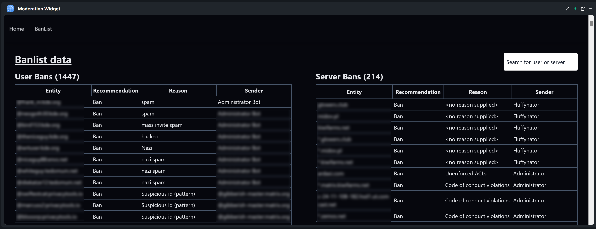

# Matrix Moderation Widget for Mjolnir

This is an experimental widget to be used in the Mjolnir moderation room.

Use at your own risk! If you break your bot and it is not an bug your issue will be closed.
Using this currently is extremely dangerous!

Room: [#mjolnir-widget:nordgedanken.dev](https://matrix.to/#/#mjolnir-widget:nordgedanken.dev)

## Screenshots


## How to start in dev mode

1. Follow https://create-react-app.dev/docs/using-https-in-development for your os
2. Run `npm start`

## How to build

Run `npm run build`.

## How to add

Something like this (room_id and https are required)

`/addwidget https://localhost:3000?room_id=$matrix_room_id`

## Hosted instance

A hosted widget is at https://moderation_widget.nordgedanken.dev/ you can add it via
`/addwidget https://moderation_widget.nordgedanken.dev?room_id=$matrix_room_id`

## Adcanced

### Use a state event to allow showing relevant Lists only in the dropdown

TODO:

1. Allow the bot to send the state event. For this you need to make the bot PL 1
and allow sending `dev.nordgedanken.mjolnir_banlists` for PL1 users.
2. Send the following state event as the bot:

You can use `/devtools` in element-web to send a custom state event.

Event Type: `dev.nordgedanken.mjolnir_banlists`
State Key: The user id of the bot
Content: 

```
{
  "banlists": {
    "#matrix-org-coc-bl:matrix.org": "COC"
  }
}
```

Edit it to fit your banlists.